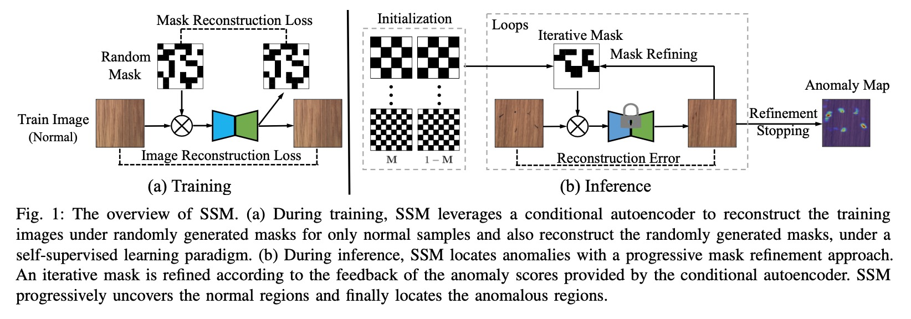

# Self-Supervised Masking for Unsupervised Anomaly Detection and Localization

This is an implementation of Self-Supervised Masking for Unsupervised Anomaly Detection and Localization (SSM) on PyTorch.

**[Paper Link](https://ieeexplore.ieee.org/document/9779083)**  



**Abstract**: Recently, anomaly detection and localization in multimedia data have received significant attention among the machine learning community. In real-world applications such as medical diagnosis and industrial defect detection, anomalies only present in a fraction of the images. To extend the reconstruction- based anomaly detection architecture to the localized anomalies, we propose a self-supervised learning approach through random masking and then restoring, named Self-Supervised Masking (SSM) for unsupervised anomaly detection and localization. SSM not only enhances the training of the inpainting network but also leads to great improvement in the efficiency of mask prediction at inference. Through random masking, each image is augmented into a diverse set of training triplets, thus enabling the autoencoder to learn to reconstruct with masks of various sizes and shapes during training. To improve the efficiency and effectiveness of anomaly detection and localization at inference, we propose a novel progressive mask refinement approach that progressively uncovers the normal regions and finally locates the anomalous regions. The proposed SSM method outperforms several state-of-the-arts for both anomaly detection and anomaly localization, achieving 98.3% AUC on Retinal-OCT and 93.9% AUC on MVTec AD, respectively.

## Get Started

### Environment
- python >= 3.7.11
- pytorch >= 1.11.0
- torchvision >= 0.12.0
- numpy >= 1.19.5
- scipy >= 1.7.3
- skimage >= 0.19.2
- matplotlib >= 3.5.2
- kornia >= 0.6.5
- tqdm

### Data preparation

Please download Retinal-OCT dataset [here](https://www.kaggle.com/paultimothymooney/kermany2018). Remember to remove the CNV, DME and DRUSEN in the training set, to provide an unsuervised setting.

After the preparation work, the whole project should has the following structure:

```
./SSMAD
├── README.md
├── OCT2017                         # data files
│   ├── train
│   ├── val                  
│   └── test
├── models                          # models and backbones
│   └── unet_multi.py
├── losses                          # losses
│   ├── ssim_loss.py
│   └── gms_loss.py   
├── datasets                        # dataset                      
│   └── retinaOCT.py
├── utils                           # utils
│   ├── utils.py
│   └── gen_mask.py
├── test.py                         # testing code
└── train.py                        # training code
```
## Quick Start
Please download the model file [here](https://drive.google.com/file/d/1K0gKQbx5fhOUI3_eXM59_l6ESd9L_NJe/view?usp=sharing).
After downloading the checkpoints, you could run evaluation by the instructions in the evaluating section.

```python
python test.py --checkpoint_dir ./save_checkpoints/retinal-11-16-8435_model.pt --data_path ./OCT2017/
```

Method     |   SSM   |  Inplementation  | Model | 
-------- |:-------:|:----------------:|:-------:
AUC (%)  |  98.3   |       98.3       | [model](https://drive.google.com/file/d/1K0gKQbx5fhOUI3_eXM59_l6ESd9L_NJe/view?usp=sharing)

## Training

To train a SSM model on the Retinal-OCT dataset, simply run:

```python
python train.py --data_path ./OCT2017 --epochs 50 --batch_size 32 --alpha 1.0 --belta 1.0 --gamma 1.0 --lr 0.0001
```

This is a simple inplementation on Retinal-OCT. To experiment on other dataset, please follow the similar pipeline.

## Citation

If you use this code, please cite the paper:

```
@ARTICLE{huang2022ssm,
  author={Huang, Chaoqin and Xu, Qinwei and Wang, Yanfeng and Wang, Yu and Zhang, Ya},
  journal={IEEE Transactions on Multimedia}, 
  title={Self-Supervised Masking for Unsupervised Anomaly Detection and Localization (early access)}, 
  year={2022},
  doi={10.1109/TMM.2022.3175611}}
```
